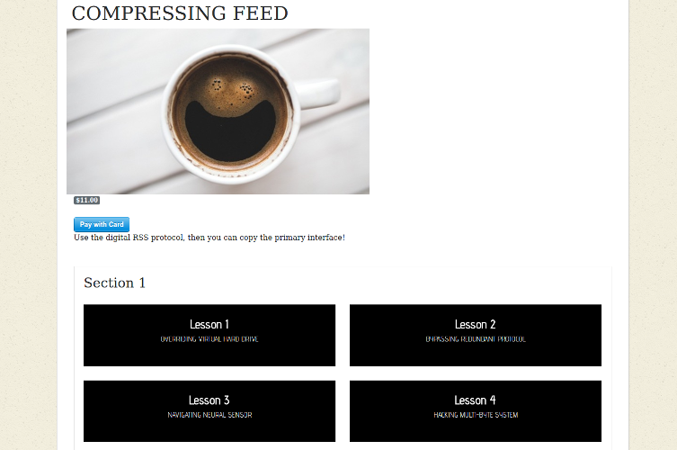

# Flixter
----------
A two sided video streaming marketplace platform, featuring credit card payment capabilities, user role management, complex user interfaces and advanced database relationships. A working version is hosted on [Heroku](https://firehose-flixter-jim-lin.herokuapp.com/).

### User Authentication and Permissions

[devise](https://github.com/plataformatec/devise) is used for account creation and permissions. Since users can be the creator of a course (instructor) or enroll in one (student), courses and lessons must have restricted access. Only the instructor of a course can edit its content and see its administration page. Since courses may cost money, only enrolled students may view the contents of a course's lessons.

### URLs and Namespaces

Because users can be instructors or students, URLs (and corresponding controllers) need to be different depending on the role of the user. For example, an instructor should be able to view and edit their courses with a URL like `flixter.com/instructor/courses/1` while a student would use the URL `flixter.com/courses/1`. Rails' built-in namespace features were used to implement this.

### Video Lessons

The lessons in this app are video based. [CarrierWave](https://github.com/carrierwaveuploader/carrierwave) is used to support file uploads in Rails. Heroku [will not save uploaded files on their servers](https://devcenter.heroku.com/articles/dynos#ephemeral-filesystem). Therefore, file uploads are stored with Amazon S3. The videos are embedded into lesson pages using [VideoJS](http://videojs.com/).

### Course Enrollment and Payment

The relationship between courses and enrolled students is a many-to-many one. This app uses the preferred ActiveRecord association `has_many :through`. The join table in this case is named Enrollments. For courses that cost money, the Stripe API is used.

### Course Creation

For instructors to easily re-order their lessons, [jQuery UI](https://jqueryui.com/)'s drag and drop features were used. This front end features is integrated with the [ranked-model](https://github.com/mixonic/ranked-model) gem, which efficiently updates the ordering of lessons in the database.
